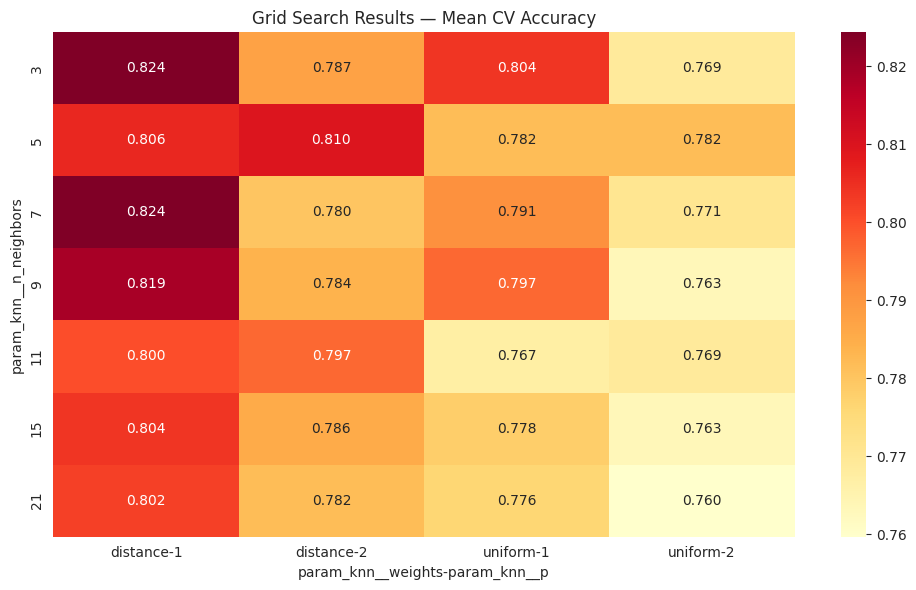
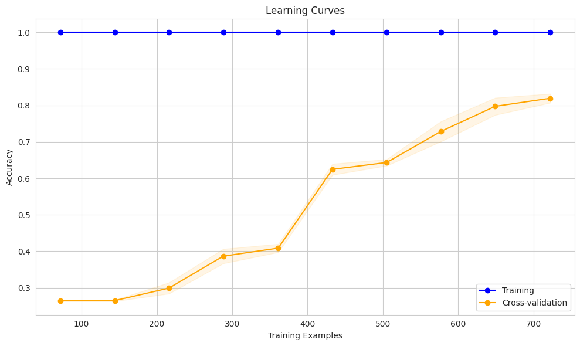
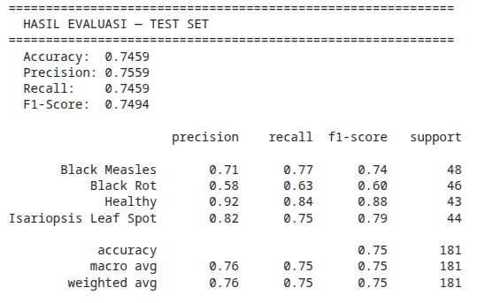

# 🍇 Grape Leaf Disease Detection — TD + KNN

**Smart Farming System for Grape Leaf Disease Detection** using **Tangential Direction (TD)** for contour-based feature extraction and **K-Nearest Neighbors (KNN)** as classifier.
---

## Table of Contents

- [Overview](#overview)
- [Dataset](#dataset)
- [Methodology](#methodology)
- [Project Structure](#project-structure)
- [Installation](#installation)
- [Usage](#usage)
- [Results](#results)
- [Image Validation](#image-validation)
- [Tools & Libraries](#tools--libraries)
- [References](#references)

---

## Overview

Early detection of grape leaf diseases is critical for improving productivity and sustainability of grape cultivation, especially in tropical environments with high humidity and lighting variation. This research develops an efficient smart farming system based on digital image processing that can run on low-cost edge devices.

The proposed method integrates:

1. **Tangential Direction (TD)** — contour-based feature extraction to capture deformation caused by disease lesions
2. **K-Nearest Neighbors (KNN)** — computationally lightweight classification algorithm
3. **Color & Texture Features** — supporting features from HSV, Lab, and GLCM

**Total feature vector: 76 dimensions** (36 TD + 36 Color + 4 Texture)

---

## Dataset

### Grape Disease Dataset Original

| Source | Kaggle |
|--------|--------|
| **Link** | [Grape Disease Dataset Original](https://www.kaggle.com/datasets/rm1000/grape-disease-dataset-original) |
| **Total** | 9,027 images |
| **Resolution** | 256 × 256 pixels |
| **Classes** | 4 |

| Class | Label | Samples |
|-------|-------|---------|
| Black Measles (ESCA) | 0 | ~2,400 |
| Black Rot | 1 | ~2,360 |
| Healthy | 2 | ~2,115 |
| Isariopsis Leaf Spot | 3 | ~2,152 |

---

## Methodology

### Pipeline

```
Input Image (256×256)
  ↓
Preprocessing
  ├── Resize (256×256)
  ├── Median Filter (denoising)
  ├── CLAHE (contrast enhancement)
  └── Otsu Threshold (leaf segmentation)
  ↓
Feature Extraction
  ├── Tangential Direction Histogram (36 bins)
  ├── Color Histogram — HSV + Lab-A (36 bins)
  └── GLCM Texture (4 features: contrast, energy, homogeneity, correlation)
  ↓
StandardScaler
  ↓
K-Nearest Neighbors (k=3, Manhattan distance, distance weighting)
  ↓
Prediction: Black Measles / Black Rot / Healthy / Isariopsis Leaf Spot
```

### Tangential Direction (TD)

Tangential Direction captures the tangent angle at each point along the leaf contour. Diseased leaves exhibit contour deformation that is reflected in changes to the TD histogram distribution.

```python
# Each contour point → tangent angle
angle = arctan2(dy, dx)  # window size = 5

# 36-bin histogram of all angles
td_hist = histogram(angles, bins=36, range=[0, 2π])
```

### K-Nearest Neighbors

Optimal hyperparameters (from GridSearchCV):

| Parameter | Value |
|-----------|-------|
| k (n_neighbors) | 3 |
| Distance metric | Manhattan (L1) |
| Weights | Distance-based |
| Cross-validation | 5-fold |

---

## Project Structure

```
td-knn-grape/
├── app.py                  # Streamlit frontend
├── run_pipeline.py         # End-to-end training pipeline
├── download_dataset.py     # Kaggle dataset download
├── requirements.txt        # Dependencies
├── README.md               # Documentation
├── src/
│   ├── __init__.py
│   ├── preprocess.py       # Image preprocessing
│   ├── features.py         # TD, color, texture extraction
│   ├── train.py            # KNN training + GridSearchCV
│   └── evaluate.py         # Evaluation & visualization
├── notebooks/
│   └── 01_eksperimen_td_knn.ipynb  # Experiment notebook
├── models/
│   └── knn_td_model.pkl    # Trained model
├── results/                # Evaluation output (plots, metrics)
└── data/train/             # Dataset (extract here)
    ├── Black Measles/
    ├── Black Rot/
    ├── Healthy/
    └── Isariopsis Leaf Spot/
```

---

## Installation

### Prerequisites

- Python 3.10+
- pip

### Setup

```bash
# Clone repository
git clone https://github.com/username/td-knn-grape.git
cd td-knn-grape

# Install dependencies
pip install -r requirements.txt

# Download dataset (via Kaggle API)
# 1. Setup Kaggle API: https://www.kaggle.com/docs/api
python download_dataset.py

# Or download manually from:
# https://www.kaggle.com/datasets/rm1000/grape-disease-dataset-original
# Extract to data/train/ with one folder per class
```

---

## Usage

### 1️⃣ Streamlit App (Frontend Testing)

```bash
streamlit run app.py
# → http://localhost:8501
```

Features:
- Upload grape leaf images (drag & drop)
- Automatic disease detection with confidence score
- Per-class probability visualization
- Leaf contour overlay
- Tangential Direction histogram display
- Non-grape-leaf image validation

### 2️⃣ Training Pipeline

```bash
python run_pipeline.py
# Or with custom paths:
python run_pipeline.py data/train models results
```

### 3️⃣ Jupyter Notebook

```bash
jupyter notebook notebooks/01_eksperimen_td_knn.ipynb
```

### 4️⃣ Kaggle Notebook

Copy the code from `notebooks/01_eksperimen_td_knn.ipynb` into a Kaggle Notebook with **Grape Disease Dataset Original** as input.

---

## Results

### Model Performance

| Metric | Value |
|--------|-------|
| Accuracy | — 0.7459 |
| Precision (weighted) | — 0.7559 |
| Recall (weighted) | — 0.7459 |
| F1-Score (weighted) | — 0.7494 |

### Confusion Matrix



### Learning Curves



### Classification Report



---

## Image Validation

The system includes a multi-layer validator to reject non-grape-leaf images:

| Check | Threshold | Output Example |
|-------|-----------|----------------|
| Green color | < 1% green pixels | "no leaf color detected" |
| Natural texture | pixel std < 15 | "uniform image, not a real leaf" |
| Contour size | < 3% of image | "object too small" |
| KNN distance | > 75 | "feature pattern does not match grape leaf" |
| TD peak | > 0.28 & distance > 50 | "contour shape atypical for grape leaf" |

---

## Tools & Libraries

- **Python** 3.10+
- **OpenCV** — image processing
- **scikit-learn** — KNN, GridSearchCV
- **scikit-image** — GLCM texture features
- **Streamlit** — frontend application
- **NumPy, Pandas** — data manipulation
- **Matplotlib, Seaborn** — visualization
- **Joblib** — model serialization

---

## References

1. Javidan et al. (2023). *Diagnosis of grape leaf diseases using automatic K-means clustering and machine learning*. Smart Agricultural Technology.
2. Krithika & Selvarani (2017). *Grape leaf disease identification using Tangential Direction based segmentation*. ICIECS.
3. Koksal & Ozuysal (2019). *Histogram of tangent directions for shape-based classification*. IET Computer Vision.
4. Safitri et al. (2024). *Klasifikasi Penyakit Daun Anggur Berbasis Citra Menggunakan Metode K-Nearest Neighbors*.

---
